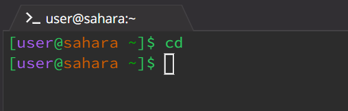

# **Week 1 - Markdown, URLs, and Paths (1/11/2024)**

This week I learned about various commands allowing me to traverse directories and files straight from my terminal.


## Commands:
### cd  
The cd command changes the working directory.

---
No arguments:
```
cd  
```
I used the cd command in the /lecture1/messages directory. Using the command without passing any arguments resulted in no output from the terminal. However, using the pwd command showed it brought me to the /home directory. Upon further experimentation, using cd with no arguments changes the working directory to /home no matter what the current working directory is. Given that this output does not produce an error message or problematic behavior, it is not an error.  
  

---
Path to directory as argument:
No arguments:
```
cd lecture1/messages
```
Here I used the cd command in the /home directory. I used the cd command to change the current working directory to the messages directory. The cd command only has access to whatever is in the working directory. As such, making the arg a path that goes from /home through /lecture1 to /messages as "lecture/messages" allows me to change the working directory from /home to /messages. Because this command usage produces no error message or problematic behavior, it is not an error.

---
Path to file as argument:
```
cd lecture1/messages/en-us.txt
```  
