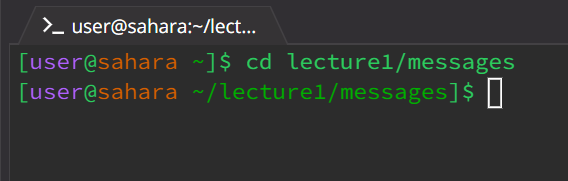
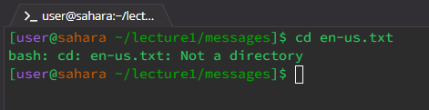
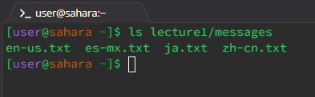
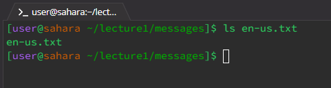
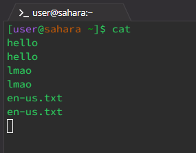
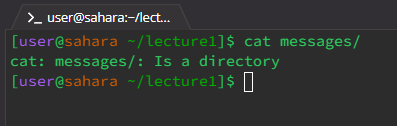
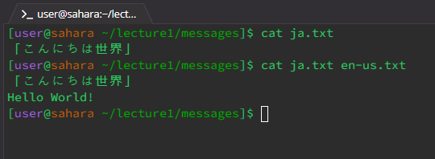

# **Week 1 - Markdown, URLs, and Paths (1/11/2024)**

This week I learned about various commands allowing me to traverse directories and files straight from my terminal.


## Commands:
### cd  
The cd command changes the working directory.

---
#### No arguments:
```
cd  
```
I used the cd command in the /lecture1/messages directory. Using the command without passing any arguments resulted in no output from the terminal. However, using the pwd command showed it brought me to the /home directory. Upon further experimentation, using cd with no arguments changes the working directory to /home no matter what the current working directory is. Given that this output does not produce an error message or problematic behavior, it is not an error.  

  
---
#### Path to directory as argument:
```
cd lecture1/messages
```
Here I used the cd command in the /home directory. I used the cd command to change the current working directory from /home to the /messages directory. The cd command only has access to whatever is in the working directory. As such, making the arg a path that goes from /home through /lecture1 to /messages as "lecture1/messages" allows me to change the working directory from /home to /messages. This change is reflected in the prompt message of the output line. Because this command usage produces no error message or problematic behavior, it is not an error.  

  
---
#### Path to file as argument:
```
cd en-us.txt
```
In this example, I used the cd command in the messages directory. I attempted to use the cd command to change the working directory from /messages to the en-us.txt file. However, because cd requires directories as arguments, this usage produced an error. This is because the cd command cannot accept paths to files as arguments as files are different from directories and the command expects directories as the argument.  

  

---
### ls  
The ls command lists files and directories contained within the working directory.

---
#### No arguments:
```
ls  
```
I used the cd command in the /lecture1 directory. Using the command without passing any arguments resulted in the terminal printing the files and directories contained within /lecture1 such as Hello.java and the messages directory. Given that this output does not produce an error message or problematic behavior, it is not an error.  

  
---
#### Path to directory as argument:
```
ls lecture1/messages
```
Here I used the cd command in the /home directory. I used the ls command to print a list of all the files in the /messages directory. The ls command only has access to whatever is in the working directory. As such, making the arg a path that goes from /home through /lecture1 to /messages as "lecture1/messages" allows me to see all the files in /messages. Because this command usage produces no error message or problematic behavior, it is not an error.  

  
---
#### Path to file as argument:
```
ls en-us.txt
```
In this example, I used the ls command on the en-us.txt file while in the /messages directory. The output of doing so was en-us.txt. Upon further experimentation, using ls on a file returns the file name if it exists in the current working directory; otherwise, it returns an error. As this is intended behavior and does not produce an error message, using ls in this way is not an error.

  

---
### cat  
The cat command prints and concatenates file contents.

---
#### No arguments:
```
cat  
```
I used the cd command in the /home directory. Using the command without passing any arguments resulted in the command printing my inputs. This is because it prints file contents but because no file was specified it prints out whatever I put in the terminal. This is indicated by a lack of prompt in further terminal inputs. Because there is no problematic behavior or error message, this is not an error as this usage has been accounted for.  

  
---
#### Path to directory as argument:
```
cat lecture1/messages
```
Here I used the cd command in the /lecture1 directory. I attempted to use the cat command to print the contents of the /messages directory. The cat command only works on files within the current working directory, therefore the command returns an error message because /messages is a directory and not a file. As such, this usage results in an error. 

  
---
#### Path to file as argument:
```
cat en-us.txt
```
In this example, I used the cat command on the ja.txt file while in the /messages directory. The output of doing so was the text contained in ja.txt. Upon further experimentation, using cat with multiple file names as args returns prints the contents of each file if it exists in the working directory. As this is intended behavior and does not produce an error message, using cat in this way is not an error.

  

